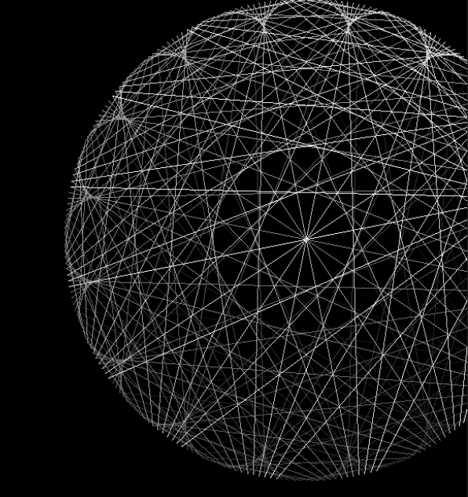

## String Art Generation

This project creates string art using Python as main language. It leverages **Pillow**, **Imageio**, **Numpy**
to generate and animate circular string patterns, exporting the final result as a sequence of rendered frames with format GIF.

## Description

String Art Generation is a demonstration of algorithmic art generation, where lines connect points around a circle to form evolving predictable patterns. It's a clear example of how code can be transformed into visual creativity.

## Technologies Used

- **Python 3.x**
- **Numpy** - numerical array processing.
- **Pillow (PIL)** - for image processing.
- **Imageio** - for compiling frames into animated GIFs.

## Install Requirements

1. **Download Python 3.13.3 or older from the official website:**

   If you wish to download Python, simply click the following link: [Download Python](https://www.python.org/downloads/)
   This will take you to the official Python website.

   If you reached this step, ensure that Python has been successfully installed on your system by running the following command in your terminal or command prompt:
   ```bash
   python --version
   ```
   It should appear something like:
   ```bash
   Python 3.13.3
   ```

3. **Navigate to the project directory and install the dependencies:**

    ```bash
    cd GenerativeStringArt
    pip install -r requirements.txt
    ```

## Previews
- The following image belongs to the software's outcome:
  
